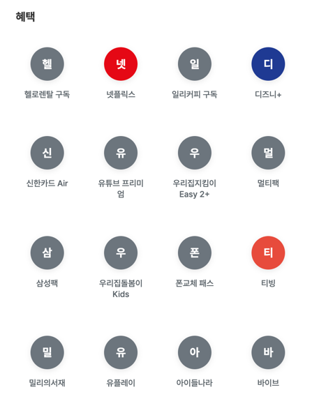
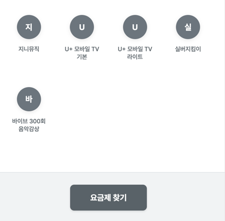
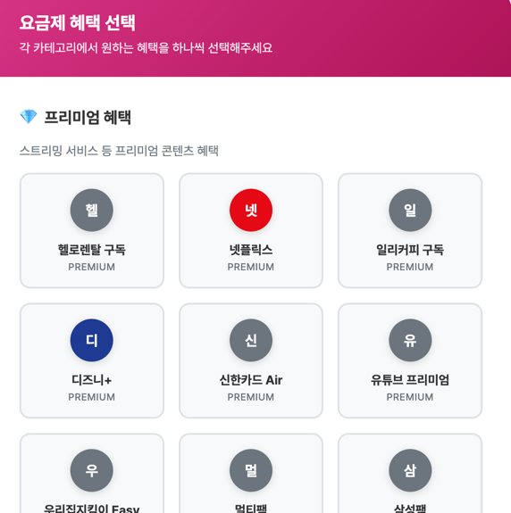
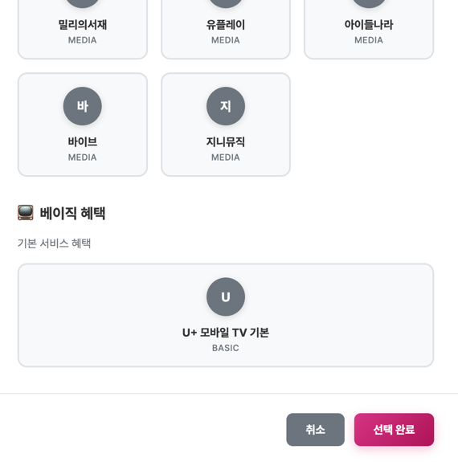

## 요기 U+
> 요금제를 기가막히게 추천해줘 U+

 

## 프로젝트 소개
> 통신 이용 데이터를 기반으로 사용자 유형을 분류하고, 요금제 정보를 통합해 비교/추천하는 서비스를 구현함으로써 사용자들이 자신에게 맞는 통신 상품을 쉽게 선택할 수 있도록 돕는 것을 목표로 합니다.

 

## 요금제 모듈 소개
> 요금제 모듈은 휴대폰 요금제에 대한 모든 것을 관리하고, 사용자가 **자신에게 딱 맞는 요금제**를 쉽게 찾을 수 있도록 돕는 기능을 제공합니다.

 

## 주요 기능

- 요금제 정보 관리
    - 새로운 요금제 등록 및 기존 요금제 정보 확인·수정 기능
    - 관리자 페이지에서 수행

- 혜택 정보 연동
    - 각 요금제가 어떤 혜택을 포함하는지 관리하고 사용자에게 보여줍니다.

- 나만의 요금제 찾기
    - 사용자가 원하는 조건(가격대, 데이터 사용량, 포함된 혜택 등)에 맞춰 요금제를 검색하고 필터링할 수 있습니다.

    - *사용자 맞춤 검색 UI*:
        - 

- 요금제 혜택 변경
    - 프리미엄, 미디어, 베이직 혜택 영역에서 각 한 가지씩 선택하여 적용 가능
    - 선택된 혜택에 따라 맞춤형 요금제로 구성 가능

    - *혜택 변경 UI*:
        - 

 

## 요금제 스마트 검색 기능 (QueryDSL 활용)

이 시스템은 **QueryDSL을 활용한 고급 필터링 기능**을 제공합니다.  
사용자가 원하는 조건을 조합해 간편하고 빠르게 요금제를 검색할 수 있습니다.

 

### 주요 기능

#### 1. 조건 기반 검색

- 카테고리, 월 요금, 데이터 사용량, 혜택 등을 기준으로 다양한 조합 검색 가능
- 필요한 정보만 효율적으로 조회하여 성능 최적화

#### 2. 세부 검색 조건

- 카테고리별 : `프리미엄`, `시니어` 등
- 가격대별 : 5만 원 이하, 6~8만 원대, 9만 원 이상
- 데이터 사용량별
  - 소량 데이터: 월 10GB 이하
  - 대량 데이터: 월 10GB 초과 or 일 5GB (월 150GB 수준)
  - 무제한 데이터: 데이터 걱정 없이 이용
- 혜택별
  - 넷플릭스 등 특정 혜택 포함 여부로 검색 가능
  - 혜택이 없는 요금제도 찾을 수 있음

#### 3. 혜택 그룹 검색

- 혜택은 '혜택 그룹' 단위로 관리
- 여러 혜택 조합이 하나의 그룹으로 구성되어 검색 가능
- 사용자가 선택한 모든 혜택을 포함하는 요금제를 정확히 조회

#### 4. 검색 결과 개수 확인

- 필터 조건에 맞는 요금제 개수를 즉시 확인 가능
- 조건 수정 시 참고 용이

 

## 기술적 특징

- **QueryDSL**기반 동적 쿼리 작성
- fetch join 및 최적화된 조인을 통해 필요한 데이터를 효율적으로 조회
- 검색 조건에 따라 요금제 수를 반환하는 빠른 카운트 쿼리 제공

 

## 트러블슈팅

### 1. N+1 문제 및 MultipleBagFetchException 발생
- Plan 엔티티와 혜택 관련 엔티티 간의 연관 관계에서 N+1 문제가 발생
- 다중 컬렉션(List 타입)을 동시에 fetch join 하려다 MultipleBagFetchException 발생
- 해결 방안으로 연관된 컬렉션 타입을 Set으로 변경하여 문제 해결

### 2. MethodArgumentTypeMismatchException 발생
- /plan/{planId}와 /plan/benefit의 경로 충돌로 인해 Spring이 경로를 잘못 해석
- benefit이 planId로 매핑되면서 Integer로 변환 실패
- /plan/benefit 경로를 명시적이고 고정된 경로로 선언하여 해결
